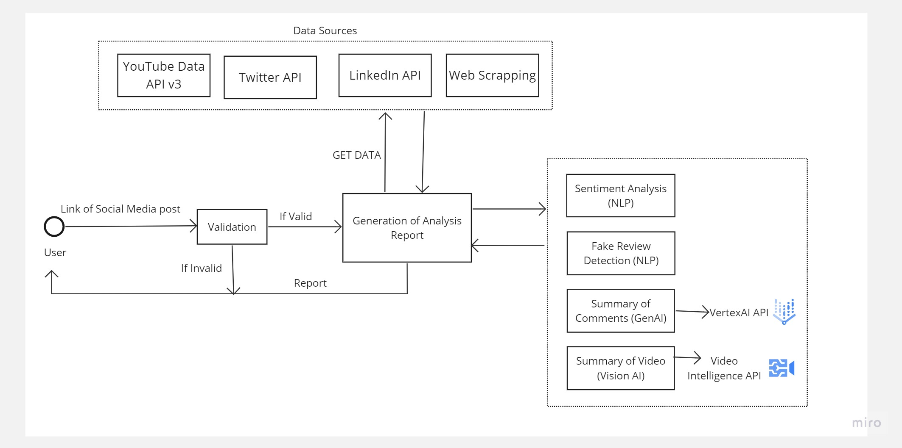

# Public Opinion Analyser

Introducing “Public Opinion Analyser”, a Web browser extension tool to analyse public opinions from comments or posts or videos in the public domain.

## Features ✨

- A quick analytic tool that sits in the browser extension toolbar, that can read comments or posts from URL of social media content.
- The analytic tool can process all the comments in the URL and get insights into the public opinion on the content.
- The tool can show descriptive as well as statistical details to explain the public opinion on the selected content.
- The tool is powered by Machine Learning models – NLP and Sentiment Analysis algorithms and AI models in the backend and UI in the frontend.
- The tool is intended to extend it to other famous social media platforms like Twitter X, Instagram, or any other platform in future. 

## Technologies 
1. Data Gathering:

        YouTube Data API v3
        Twitter API
        LinkedIn API
        Web scraping

2. AI and NLP models used:

        Lexicon-based sentiment analysis
        Tokenization
        NLP based Fake review detection model
        Vertex AI API
        Video Intelligence API

3. UI:

        React Js

## Architecture -

## Detailed Presentation - 
[Presentation](PublicOpiniunAnalyzerPresentation.pdf)

